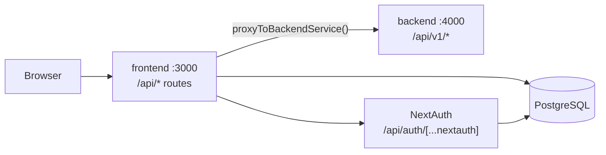

# Monorepo Architecture

Authoritative reference for the GlimmoraTeam repository layout.

## Overview

```
glimmora-team/                    npm workspaces root
├── frontend/                     Next.js 16 — UI, NextAuth, Prisma, API proxies
├── backend/                      Backend team scaffold (implement /api/v1/*)
├── docs/                         Specs, guides, audits, architecture
├── samples/                      Sample datasets (e.g. SOW JSON)
├── ux-research/                  UX research artifacts
├── package.json                  Workspace scripts (dev, build, db:*)
├── README.md                     Quick start
├── CLAUDE.md                     AI / developer conventions
└── HANDOFF.md                    Session handoff notes
```

## Request flow



1. **Browser** calls stable public URLs at `/api/*` on the Next.js app.
2. **Proxied routes** in `frontend/src/app/api/` forward to the backend via `frontend/src/lib/api/backend-service.ts`.
3. **Backend** implements handlers under `/api/v1/*` (see `backend/README.md`). The current `backend/` folder is a clean scaffold for the backend team.
4. **Prisma + many API routes** still run inside the frontend (`frontend/prisma/`, `frontend/src/lib/*`).
5. **NextAuth** remains in the frontend.

### Environment

| Variable | Where | Purpose |
|----------|-------|---------|
| `DATABASE_URL` | `frontend/.env.local` | PostgreSQL (NextAuth + Prisma routes) |
| `AUTH_SECRET`, OAuth keys | `frontend/.env.local` | NextAuth |
| `BACKEND_SERVICE_URL` | `frontend/.env.local` | Proxy target (default `http://localhost:4000`) |
| `BACKEND_PORT` | `backend/.env` | Backend listen port |

Run both services locally:

```bash
npm install
npm run dev:all    # frontend :3000 + backend :4000
```

## Frontend (`frontend/`)

| Path | Role |
|------|------|
| `src/app/` | App Router pages — enterprise, contributor, mentor, admin, auth |
| `src/app/api/` | API routes — proxies + direct Prisma handlers |
| `src/lib/api/` | Client fetch layer + `backend-service.ts` proxy helper |
| `prisma/` | Schema + migrations (source of truth) |
| `scripts/` | Dev seeds — `ensure-admin.ts`, `seed-track-test-users.ts`, etc. |
| `src/generated/prisma/` | Generated Prisma client |
| `vercel.json` | Vercel build config |

**Deployment:** Set Vercel **Root Directory** to `frontend`.

## Backend (`backend/`)

| Path | Role |
|------|------|
| `src/server.ts` | Hono entry (health check scaffold) |
| `README.md` | Full `/api/v1/*` contract for the backend team |

Previous implementation removed — see git history for reference.

## Proxied routes (backend team implements)

- Auth: register, validate, OTP, password, SSO discover/intent
- Session: `/me`, `/sessions`
- SOW lifecycle, workforce, review queues, submissions, notifications, payouts, Razorpay

### Still in Next.js

- `/api/auth/[...nextauth]` and OAuth/SAML/OIDC callbacks
- Contributor profile/credentials, decomposition, admin mock APIs
- Many domain services under `frontend/src/lib/` that use Prisma directly

## Prisma client generation

Schema: `frontend/prisma/schema.prisma`. Output: `frontend/src/generated/prisma/`.

```bash
npm run db:generate   # from repo root
```

## Documentation map

| Folder | Contents |
|--------|----------|
| `docs/architecture/` | System design, RBAC, this file |
| `docs/guides/` | Auth flows, login/onboarding user flows |
| `docs/audits/` | Portal audits, scratch findings |
| `docs/backend-handoff/` | Subscription/tenant API specs |
| `docs/phase-2/` | Backend extraction notes |
| `docs/portal-specs/` | Per-portal functional specs |
