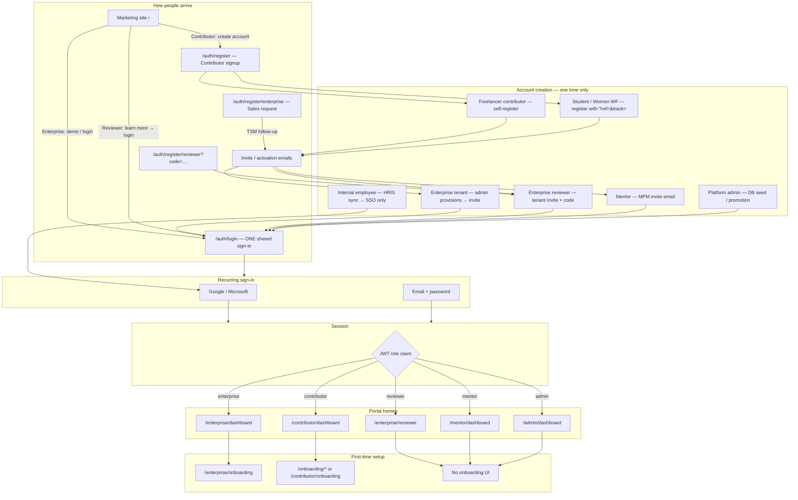
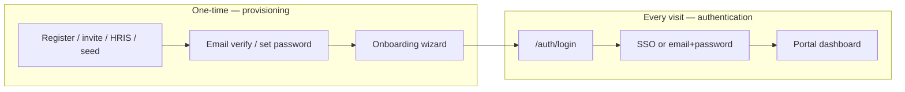
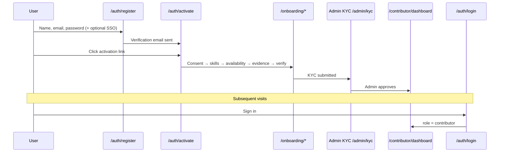
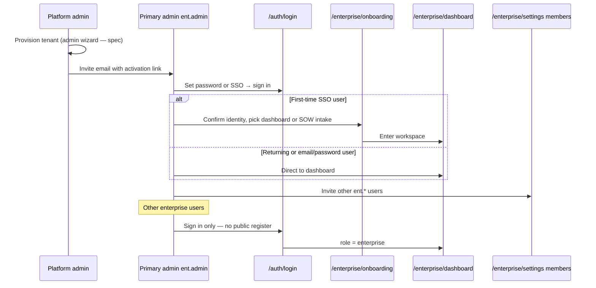
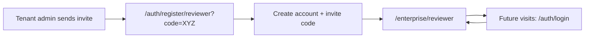
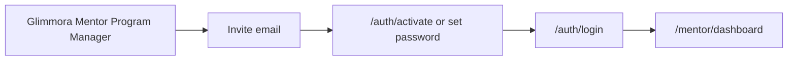
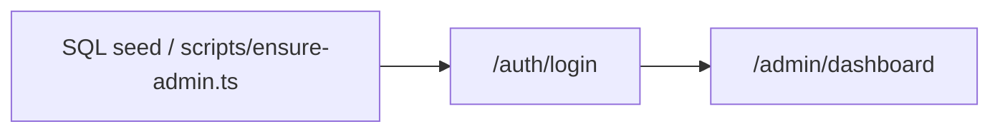
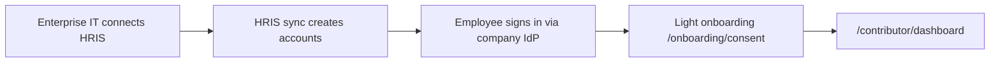
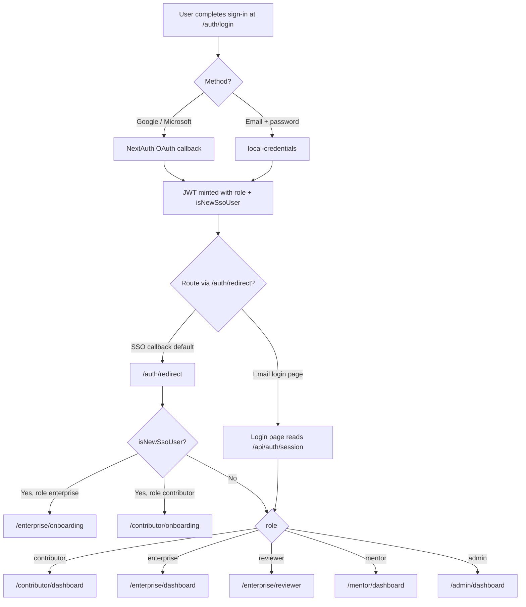
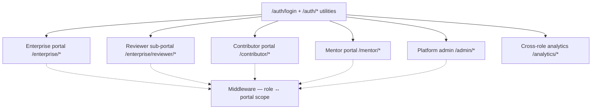

# GlimmoraTeam — Login & Onboarding User Flows

> **Document type:** Product & engineering reference  
> **Audience:** Product, design, engineering, customer success  
> **Last updated:** 2026-05-29  
> **Related:** [`auth-flow.md`](auth-flow.md) (technical IAM reference)

---

## Table of contents

1. [Executive summary](#1-executive-summary)
2. [The one shared login door](#2-the-one-shared-login-door)
3. [Master flow diagram](#3-master-flow-diagram)
4. [Who clicks what?](#4-who-clicks-what)
5. [Account creation vs recurring sign-in](#5-account-creation-vs-recurring-sign-in)
6. [Role-by-role flows](#6-role-by-role-flows)
7. [Post sign-in routing](#7-post-sign-in-routing)
8. [Portal interconnection](#8-portal-interconnection)
9. [Registration URLs reference](#9-registration-urls-reference)
10. [Onboarding routes reference](#10-onboarding-routes-reference)
11. [Why the login UI feels confusing today](#11-why-the-login-ui-feels-confusing-today)
12. [Spec vs built status](#12-spec-vs-built-status)
13. [Recommended UX copy (future)](#13-recommended-ux-copy-future)
14. [Glossary](#14-glossary)

---

## 1. Executive summary

**Every actor uses the same sign-in URL:** `/auth/login`

**But accounts are created in different ways** depending on role. The **“Create account”** link on the login page today only serves **contributors**. Enterprise, reviewer, mentor, and platform admin users are **invite- or admin-provisioned** — they do not self-register through that button.

| Concept | Meaning |
|--------|---------|
| **Login** | Front door for everyone who **already has** an account |
| **Register (`/auth/register`)** | Back door for **contributors** (+ referral links for student / women-workforce tracks) |
| **Invite email** | Back door for **enterprise**, **reviewer**, **mentor**, and most **admin** users |
| **Admin seed / promote** | Back door for **first platform admins** |
| **Enterprise request form** | Sales-led tenant request — **not** instant account creation |

---

## 2. The one shared login door

All portals share a single authentication entry point.

```
https://app.glimmora.app/auth/login
```

### Sign-in options (same for everyone)

| Method | Implementation |
|--------|----------------|
| Google SSO | NextAuth `Google` provider |
| Microsoft SSO | NextAuth `MicrosoftEntraID` provider |
| Email + password | NextAuth `local-credentials` provider (Prisma + bcrypt in Phase 1) |

### JWT session (simplified)

After successful sign-in, the session JWT carries:

```ts
{
  sub:      user.id,
  email:    user.email,
  name:     user.display name,
  role:     "contributor" | "enterprise" | "reviewer" | "mentor" | "admin" | …,
  provider: "local-credentials" | "google" | "microsoft-entra-id" | …,
  isNewSsoUser?: boolean,  // first-time SSO user → onboarding
}
```

The **`role`** claim determines which portal home the user lands on. Middleware (`src/proxy.ts`) enforces portal scope — e.g. a contributor cannot access `/enterprise/*`.

### Portal home routing

| JWT `role` | Default landing URL |
|------------|---------------------|
| `contributor` | `/contributor/dashboard` |
| `enterprise` | `/enterprise/dashboard` |
| `reviewer` | `/enterprise/reviewer` |
| `mentor` | `/mentor/dashboard` |
| `admin` / `super_admin` | `/admin/dashboard` |

---

## 3. Master flow diagram



---

## 4. Who clicks what?

| Actor | Uses `/auth/login`? | Uses “Create account” on login page? | How account is actually created |
|-------|---------------------|--------------------------------------|----------------------------------|
| **Contributor (freelancer)** | Yes | **Yes** → `/auth/register` | Self-register → email verify → onboarding → KYC |
| **Contributor (student)** | Yes | Via referral link `/auth/register?ref=…&track=student` | University partner link |
| **Contributor (women workforce)** | Yes | Via referral link `/auth/register?ref=…&track=women_wf` | Partner org link |
| **Contributor (internal employee)** | Yes | No — provisioned by employer HRIS | HRIS sync → enterprise SSO only |
| **Enterprise admin / PMO / finance / IT / sponsor** | Yes | **No** (wrong page if they click it) | Tenant provisioned by platform admin → **invite email** |
| **Enterprise reviewer (`ent.reviewer`)** | Yes | **No** | Tenant admin invite → `/auth/register/reviewer?code=…` |
| **Mentor** | Yes | **No** | Glimmora MPM invite email |
| **Platform admin** | Yes | **No** | DB seed (`scripts/ensure-admin.ts`); Phase 2 promotion UI |

### Landing page (`/`) vs login page

The marketing homepage already splits audiences more clearly than the login page:

| Homepage section | CTA | Destination |
|------------------|-----|-------------|
| For Enterprises | Request a Demo | `/auth/login` |
| For Contributors | Create an Account | `/auth/register` |
| For Reviewers | Learn More | `/auth/login` |

---

## 5. Account creation vs recurring sign-in



---

## 6. Role-by-role flows

### 6.1 Contributor (freelancer) — public self-signup



**Key routes:** `/auth/register` → `/auth/activate` → `/onboarding/*` → `/contributor/dashboard`

**Contributor sub-tracks** (same JWT role `contributor`, different profile `track`):

| Sub-type | Track value | Onboarding branch |
|----------|-------------|-------------------|
| Freelancer | `freelancer` | Generic `/onboarding/consent` + skills + … |
| Student | `student` | `/onboarding/student` |
| Women workforce | `women_wf` | `/onboarding/women` |
| Internal employee | `internal` | Lightweight consent + skills; **no KYC** |

---

### 6.2 Enterprise — invite-first (not self-register via login CTA)



**Enterprise self-service request (not instant signup):**

- URL: `/auth/register/enterprise`
- User submits company + contact details
- Response: “Request received — TSM will email within one business day”
- Does **not** create a live tenant or login immediately

**Spec’d full enterprise onboarding wizard** (partially built):

| Step (spec) | Built today? |
|-------------|--------------|
| Confirm tenant metadata | Partial |
| Invite other ent.* users | Via settings (partial) |
| Configure SOW upload destination | No |
| Set retention defaults | No |
| Accept MSA reference | No |
| Confirm identity + pick start surface | **Yes** (`/enterprise/onboarding`) |

---

### 6.3 Enterprise reviewer — sub-portal

Reviewers use the **same login page** but land in **`/enterprise/reviewer`**, not the main enterprise dashboard.



---

### 6.4 Mentor — invite only



- **No public register page**
- **No dedicated mentor onboarding wizard** (spec pending)
- Preferred sign-in: Google for `@glimmora.team` emails

---

### 6.5 Platform admin — seed / promote only



- **Production (spec):** Glimmora SSO only — no password fallback
- **Dev:** `admin@glimmora.ai` + local credentials for testing
- **No onboarding UI**

---

### 6.6 Internal employee (contributor track)



- Never uses `/auth/register`
- Never sets a password in Glimmora
- Identity verified by employer IdP

---

## 7. Post sign-in routing

### Decision tree at login



### Middleware portal enforcement

After landing, every request to a protected route is checked:

- User's JWT `role` must match the portal prefix (`/enterprise/*`, `/contributor/*`, etc.)
- Mismatch → redirect to own portal home with `?reason=portal_mismatch`

---

## 8. Portal interconnection

Five portals, one authentication system:



**Reviewer note:** Reviewers live **inside** the enterprise URL namespace (`/enterprise/reviewer`) but receive a **different sidebar IA** when `role === "reviewer"`.

---

## 9. Registration URLs reference

| URL | Purpose | Creates account immediately? | Typical user |
|-----|---------|-------------------------------|--------------|
| `/auth/register` | Contributor self-registration | Yes (after verify) | Freelancer |
| `/auth/register?ref={id}&track=student` | Referred student signup | Yes (after verify) | University student |
| `/auth/register?ref={id}&track=women_wf` | Referred women-workforce signup | Yes (after verify) | Partner program candidate |
| `/auth/register/enterprise` | Enterprise tenant **request** | **No** — sales follow-up | Prospective customer |
| `/auth/register/reviewer?code={code}` | Reviewer signup with invite | Yes (after verify) | Enterprise reviewer |
| *(none public)* | Mentor signup | Invite email only | Glimmora mentor |
| *(none public)* | Platform admin | DB seed / promotion | Glimmora staff |

---

## 10. Onboarding routes reference

### Contributor onboarding

| Route | Purpose |
|-------|---------|
| `/onboarding/consent` | Platform T&C, privacy |
| `/onboarding/skills` | Skill self-attestation |
| `/onboarding/availability` | Hours + timezone |
| `/onboarding/evidence` | Credentials / portfolio |
| `/onboarding/verify` | KYC document upload |
| `/onboarding/student` | Student-specific branch |
| `/onboarding/women` | Women-workforce branch |
| `/onboarding/complete` | Completion + redirect |
| `/contributor/onboarding/*` | In-portal onboarding (SSO skip path) |

### Enterprise onboarding

| Route | Purpose | Status |
|-------|---------|--------|
| `/enterprise/onboarding` | Identity confirm + choose dashboard vs SOW intake | **Built** (lightweight) |
| Full tenant wizard (metadata, invites, MSA, retention) | Spec in `docs/guides/auth-flow.md` §6.2 | **Partial / Phase 2** |

### Mentor / admin onboarding

| Portal | Dedicated onboarding route | Status |
|--------|---------------------------|--------|
| Mentor | — | **Not built** |
| Platform admin | — | **Not needed Phase 1** |

---

## 11. Why the login UI feels confusing today

| Issue | Explanation |
|-------|-------------|
| Single login, many provisioning paths | Only contributor path is linked from login |
| “Create account” → `/auth/register` | Correct for contributors; **misleading** for enterprise / reviewer / mentor / admin |
| Enterprise “signup” is not on login | Lives at `/auth/register/enterprise` (request form) or invite email |
| Reviewer signup is hidden | `/auth/register/reviewer` — only via invite link |
| Homepage vs login inconsistency | Homepage routes contributors to register; login header also says “Create account” for everyone |

### Mental model (share with stakeholders)

```
LOGIN          = front door for everyone who already has an account
REGISTER       = back door for contributors (+ referral query params)
INVITE EMAIL   = back door for enterprise, reviewer, mentor, admin
ADMIN SEED     = back door for first platform admins
ENTERPRISE FORM = sales request, not instant provisioning
```

---

## 12. Spec vs built status

| Concern | Spec intent | Built today | Code / route |
|---------|-------------|-------------|--------------|
| Shared login UI | One `/auth/login` | ✅ Yes | `src/app/auth/login/` |
| Contributor self-register | `/auth/register` | ✅ Yes | `src/app/auth/register/page.tsx` |
| Enterprise tenant request | Sales form | ✅ Yes | `src/app/auth/register/enterprise/` |
| Reviewer register + code | Invite link | ✅ Yes | `src/app/auth/register/reviewer/` |
| Email + password (local dev) | Prisma + bcrypt | ✅ Yes | `src/auth.ts` — `local-credentials` |
| Google / Microsoft SSO | NextAuth | ✅ Yes | `src/auth.ts` |
| Role → portal routing | Middleware | ✅ Yes | `src/proxy.ts` |
| Contributor onboarding | Multi-step | ✅ Yes | `/onboarding/*`, `/contributor/onboarding` |
| Enterprise onboarding (full wizard) | Multi-step tenant setup | 🟡 Partial | `/enterprise/onboarding` — light welcome only |
| Mentor onboarding | Brief wizard | ❌ No | — |
| HRIS internal employee provisioning | Scheduled sync | ❌ Stub only | — |
| Partner referral invite generator | Admin UI link | 🟡 Partial | `invite-link-card.tsx` |
| MFA / upstream API auth | Phase 2 | 🟡 Wired, dormant in dev | `src/auth.ts` — `credentials` provider |

---

## 13. Recommended UX copy (future)

Suggested login page footer split to reduce confusion:

| Audience | Label | Link |
|----------|-------|------|
| Contributors | **Create a contributor account** | `/auth/register` |
| New enterprise org | **Request enterprise access** | `/auth/register/enterprise` |
| Enterprise / reviewer (invited) | **Invited by your organization?** Sign in above | — |
| Already have an account | **Sign in** | (current page) |

---

## 14. Glossary

| Term | Definition |
|------|------------|
| **Provisioning** | One-time creation of a user account in the system |
| **Authentication** | Recurring sign-in to prove identity |
| **JWT role** | Single string on session (`contributor`, `enterprise`, …) used for portal routing today |
| **Scoped roles (spec)** | Fine-grained taxonomy (`ent.admin`, `plat.tsm`, …) — Phase 1B migration |
| **Track** | Contributor sub-type stored on profile (`freelancer`, `student`, `women_wf`, `internal`) |
| **TSM** | Tenant Success Manager — provisions enterprise tenants |
| **MPM** | Mentor Program Manager — invites mentors |
| **SSO** | Single sign-on via Google, Microsoft, or enterprise IdP |
| **isNewSsoUser** | JWT flag; first OAuth login → route to onboarding |
| **Sub-portal** | Reviewer IA under `/enterprise/reviewer` with `reviewer` role |

---

## Appendix A — File & route index

| Area | Path |
|------|------|
| Login page | `src/app/auth/login/` |
| Auth screen primitives | `src/components/auth/auth-screen.tsx` |
| Contributor register | `src/app/auth/register/page.tsx` |
| Enterprise request | `src/app/auth/register/enterprise/page.tsx` |
| Reviewer register | `src/app/auth/register/reviewer/page.tsx` |
| Post-SSO redirect | `src/app/auth/redirect/page.tsx` |
| Email activation | `src/app/auth/activate/page.tsx` |
| Enterprise onboarding | `src/app/enterprise/onboarding/page.tsx` |
| NextAuth config | `src/auth.ts` |
| Technical auth doc | `docs/guides/auth-flow.md` |
| Enterprise portal spec | `docs/portal-specs/02-enterprise-portal.md` |

---

## Appendix B — Exporting this document

This file lives in the repository at:

```
docs/guides/login-and-onboarding-user-flows.md
```

**To download:**

1. **From GitHub:** open the file → **Raw** → Save As, or download the repo / docs folder.
2. **From your machine:** the file is at `GlimmoraTeam-Project/docs/guides/login-and-onboarding-user-flows.md`.
3. **Convert to PDF (optional):** open in VS Code / Cursor with a Markdown PDF extension, or use Pandoc:
   ```bash
   pandoc docs/guides/login-and-onboarding-user-flows.md -o login-and-onboarding-user-flows.pdf
   ```

Mermaid diagrams render in GitHub, GitLab, Notion (with plugin), and most Markdown viewers that support Mermaid.

---

*End of document*
